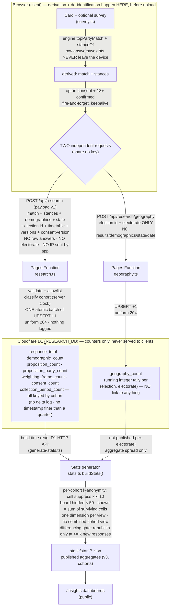

# Research data flow

Status: **Describes the built system.** Concerns the security of research data. See ADR
[0007](../adr/0007-same-origin-research-backend.md), ADR
[0006](../adr/0006-legal-compliance-rebuild.md) (D2 consent model), ADR
[0008](../adr/0008-aggregate-counters.md) (aggregate counters), `apps/web/src/lib/survey.ts`,
`apps/web/functions/api/research.ts`, `apps/web/functions/api/research/geography.ts`, and
`packages/data-pipeline/src/{stats.ts,bin/generate-stats.ts}`.

This is the reference for **where de-identification happens and what each hop carries**. The single
most important fact: **the raw answer vector and weights never leave the device** — the client
derives a top-party match and per-proposition stances with the same engine that renders the card,
and the server only ever **increments aggregate counters**. No per-person research record exists at
any hop at rest. The electorate additionally travels on a separate, unlinkable request.

## Diagram

## Hop-by-hop: what each carries

### 1. Browser → derivation → the split (client, `survey.ts`)
The card and scoring are entirely client-side. The optional survey uploads **only** after an
explicit, unticked opt-in consent + 18+ confirmation shown *after* the result — never
automatically, never on skip, never on tab-close. At upload the client:

- **derives on device**: `topPartyMatch` (the same engine scoring the card shows) reduces the
  answers to a single best-match party key, and `stanceOf` reduces each answered proposition to
  agree / neutral / disagree. **The `{id, points, important}` vector is never serialised into any
  request** — this is the primary minimisation control (payload v1, ADR-0008);
- **splits into two independent `fetch` requests that share no key or token**: the derived
  contribution → `POST /api/research`; the electorate → `POST /api/research/geography`.

Both requests are fire-and-forget (`keepalive`), so failure never affects the card.

### 2a. `POST /api/research` → counter UPSERTs (`research.ts`)
Carries the **derived match** (party slug or null), the **stances** (`{id, stance}`), the
**demographics** (some sensitive), the **state**, the **election id**, the election's **AEC
timetable** boundaries (public build-time facts), the dataset/app **versions**, and the **consent
version**. It carries **no raw answers, no weights, no electorate**. The server:

- **reads no identifier** — `CF-Connecting-IP` is never accessed; no cookie, device id, or
  per-record token — and **emits no logging or error reports** (the in-flight payload is the one
  place a profile momentarily exists; it must not be copied into any log);
- **allowlist/shape-validates** every value (off-list → dropped, never stored); a payload without a
  valid consent version is dropped entirely;
- **classifies the cohort** (`pre-declaration`/`live`/`post-election`/`historical`/`unknown`) from
  *its own* trusted clock against the supplied timetable, not from client-claimed timing;
- applies the contribution as **one atomic batch of counter increments** — the executable form of
  the estimand registry (`analysis-plan.md`). **Key rule:** counter rows for sensitive dimensions
  are stored national-only. Nothing records that the increments came from one request — no delta
  log, no insertion-order key, no shared token (a per-request bundle at rest would be a temporary
  person record; see ADR-0008);
- **always replies `204`** with no body, so the endpoint reveals nothing and cannot be probed.

Nothing per-person is stored — only `key → n` counter rows, every time-varying one keyed by cohort.

### 2b. `POST /api/research/geography` → `geography_count` (`geography.ts`)
Carries **only** the election id + electorate (division-name shaped). The server validates the
shape, reads no identifier, and does a single **UPSERT that increments an integer** tally per
`(election_id, electorate)` — no results, demographics, state, date, or key to anything. Uniform
`204`.

### 3. D1 (`RESEARCH_DB`) — private store, counters only
Every table is a running count (the analysis plan's closed estimand list) — no delta log, no
per-request bundle, no timestamp finer than the collection quarter. **Never served to clients** —
only the build output of step 4 is public. A leak of this store exposes group counts; the residual
risk is a small cell in a rare bucket, capped by the key rule (see `threat-model.md` T1/T4).

### 4. Build-time stats generator (`generate-stats.ts` → `stats.ts buildStats`)
On a scheduled rebuild+deploy the generator reads the **counter rows** over the D1 HTTP API
(credentials absent locally → empty, and the existing file is kept) and applies **k-anonymity
disclosure control, per cohort**:

- a cell publishes only at **k ≥ 10** (`MIN_CELL`), suppressed within its own cohort (the counters
  are cohort-keyed at ingestion, so cohort filtering can never surface a sub-k cell);
- a cohort's board stays hidden below **50** responses (`DASHBOARD_MIN`);
- a bucket's `shown` denominator is the **sum of surviving cells**, never the true total;
- **one demographic dimension per view**; sensitive dimensions have no state roll-up (none exists);
- **no combined cell-view when more than one cohort is present** (differencing protection), and
  **no electorate-level view at all**;
- party keys not present in the compiled dataset are never published;
- **snapshot differencing gate**: an election's file is only replaced when ≥ `MIN_CELL` new
  responses have accrued since the published file (`STATS_FORCE=1` for deliberate regeneration,
  e.g. a deliberate regeneration).

Output: `apps/web/static/stats/*.json` (schema v3, cohort-aware) + `index.json`, served statically
to the public `/insights` dashboards.

## Where de-identification / minimisation happens (summary)

| Control | Where | Effect |
|---------|-------|--------|
| Raw answers/weights reduced to match + stances | **Client, before upload** (`survey.ts` + engine) | The fingerprint never exists off-device |
| Electorate split onto a keyless request | **Client, before upload** (`survey.ts`) | Electorate never travels/rests linked to anything |
| No IP / cookie / device id / token; no logging | Client + both Functions | No identifier enters the store; the in-flight profile is never captured |
| No delta log / per-request bundle; no time finer than a quarter | `research.ts` + migration 0001 | Nothing can regroup one request's increments into a temporary person record |
| Aggregate-only writes (counters, atomic batch) | `research.ts` | No per-person row exists at rest; a leak exposes counts |
| Key rule: sensitive dimensions national-only | `research.ts` (+ generator defence-in-depth) | Worst leaked row = "one person somewhere in Australia" |
| Cohort classified server-side; counters cohort-keyed | `research.ts` | Cohorts exact; per-cohort suppression inherent |
| Poisoning: prevention + infra detection (no in-DB delta) | Cloudflare per-IP rate limit / proof-of-work / request analytics | Integrity without a person-reconstructable delta store |
| Per-cohort k ≥ 10, no-leak denominator, no combined/electorate view, dataset-checked parties, differencing gate | Build time (`stats.ts`, `generate-stats.ts`) | Published aggregates are k-anonymous and cannot be differenced below k |

**Site telemetry is entirely separate from this flow.** Usage is measured by cookieless Cloudflare
Web Analytics at the edge (no client tag, no cookie, no identifier). The site transmits **no**
client-side error data at all — there is no error beacon and no client-error endpoint. Nothing here
touches the research/geography endpoints, which stay zero-log by contract (a guard test asserts they
contain no `console.*`).
